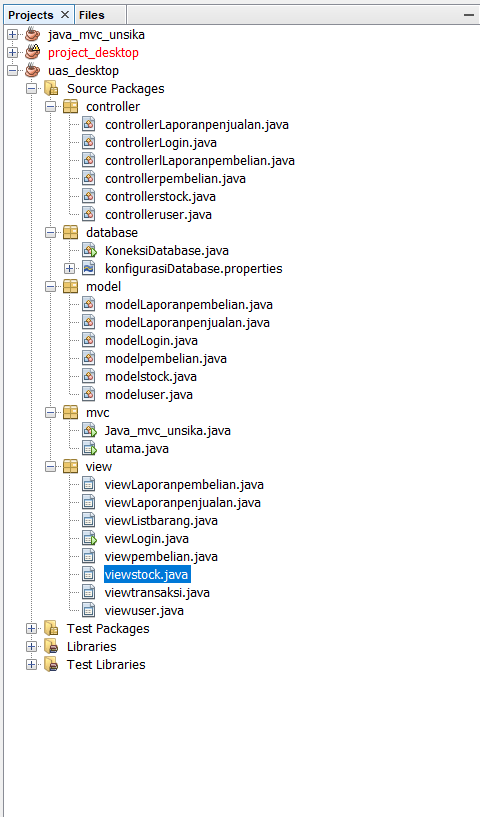

# Open Project File 
- Harus install terlebih dahulu aplikasi Git CLI
https://git-scm.com/downloads
- Clone this repository
```console
https://github.com/Fikhhz/project_uas_karyalogam.git
```
- Lakukan ```git clone``` pada respository yang tadi kita copy, Buka Netbeans lalu pilih ```Open Projects```<br>

-Didalamnya terdapat package terdiri dari controller, database, model, mvc, dan view <br>


# Result Application
- Tampilan Halaman Utama


- Tampilan Menu Penjualan
# project_uas_karyalogam
5B Kelompok 4 Pemprograman Desktop

Anggota Kelompok :
1. Ahmad Fauji
2. Anton Taufik Hidayat
3. Aprilianda Shafa Aryana
4. Tawang Sahro Winanto
